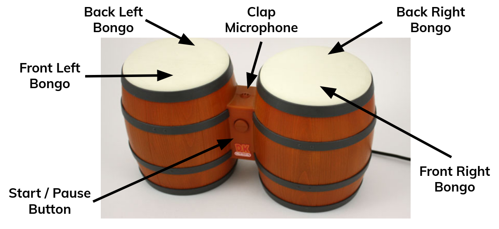

# martillo

Rust subcomponent of [DK-BASIC](https://github.com/johnDeSilencio/DK-BASIC)
for processing and applying the user config file `mappings.toml` at runtime

## `mappings.toml`

When `martillo` runs on [DK-BASIC](https://github.com/johnDeSilencio/DK-BASIC)
hardware, it checks for the presence of the file `mappings.toml` in the micro
SD card. On DK-BASIC bootup, `martillo` parses this file to determine settings
for the session. The following format is used for `mappings.toml`

```toml
[global]
# ...

[[freestyle]]
# ...

[[freestyle]]
# ...

# ...
```

## Definitions

* __Beat__ - one user input, e.g. hitting the Back Left Bongo
* __Rhythm__ - sequence of user inputs, e.g. hitting the Back Left Bongo
and then the Front Right Bongo

### `[global]`

The following are settings that can be defined in the `[global]` section
of `mappings.toml`:

```toml
debounce = 10  # don't detect beats faster than every 10ms (minimum)
# UP TO...
debounce = 500 # don't detect beats faster than every 500ms (maximum)

combo-window = 100  # consider two button presses separate beats at least 100ms apart (minimum)
# UP TO...
combo-window = 5000 # consider two button presses separate beats at least 5000ms apart (maximum)
```

Example global section:

```toml
[global]
debounce = 200       # after each beat, don't detect another for 200ms
combo-window = 1000  # provide the user with a 1000ms window to perform combo beats
# ...
```

### `[[freestyle]]`

By default, if the `[[freestyle]]` section of `mappings.toml` is empty,
DK-BASIC cannot be put into Freestyle Mode. If the `[[freestyle]]` section is
not empty and defines valid rhythms, DK-BASIC can be put into Freestyle Mode.
In this mode, the user defined "rhythms", user-defined combinations of inputs,
are used to map to keystrokes on the PS2 output interface.

Consider the following `[[freestyle]]` section:

```toml
[[freestyle]]
character = "!"
beats = ["BRB", "FRB", "BRB"]
delays = [800, 400]
```

Here, we define the following mapping: "If I hit the Back Right Bongo (BRB), then
hit the Front Right Bongo (FRB) within the next 800ms, and finally hit the Back
Right Bongo within 400ms of that hit, then output the '!' character". Notice that
we provide the timing between the hits, so with three beats we only specify two
timing requirements.

If you orient the bongos so the Start/Pause button faces you, the bongo inputs are
defined as the following:

```rust
"BLB" => BackLeftBongo
"FLB" => FrontLeftBongo
"BRB" => BackRightBongo
"FRB" => FrontRightBongo
"SPB" => StartPauseButton
"MIC" => ClapMicrophone
```



### `[[freestyle]]` limitations

The `[freestyle]` section of a  valid `mappings.toml` file may have
the following:

1. Up to 64 unique rhythms (duplicates are ignored), inclusive
2. Up to 16 beats per rhythm, inclusive

### Requirements for `mappings.toml`

If `martillo` is unable to read `mappings.toml`, e.g. if the micro SD is not
present, or if the contents of `mappings.toml` are invalid, it will use
hard-coded defaults for the session.

The `[global]` section of `mappings.toml` may be empty, and `[[freestyle]]` headers
should only be present if there is at least one freestyle rhythm defined, meaning
the following is a valid `mappings.toml` file:

```toml
[global]

```

### Validating `mappings.toml`

If you would like to validate your `mappings.toml` file, follow these steps:

1. [Download and install Rust and its package manager, `cargo`](https://www.rust-lang.org/tools/install)
2. Download this project and use `cargo` to run it with the `validate` verb:

```bash
$> git clone https://github.com/johnDeSilencio/martillo.git
...
$> cd martillo/
$> cargo build
$> cargo run -- validate "[path to your mappings.toml file]"
```
